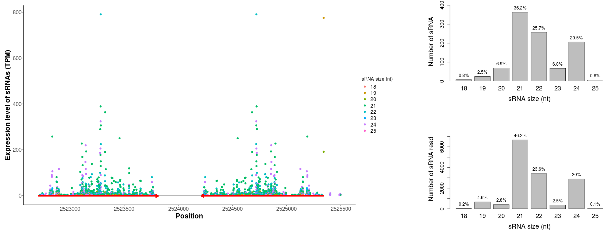
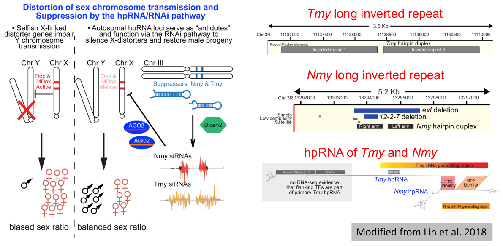

>A typical long inverted repeat and the small RNAs originated from the LIR analyzed utilizing LIRBase are demonstrated in the following image.  

<i class="fa fa-circle" aria-hidden="true"></i> <b>siRNA derived from long inverted repeats play important biological roles</b>  
>In 2018, Lin et al. identified two long hpRNAs in *Drosophila simulans*, which could be processed into 21-nt siRNAs [4]. 
>These siRNAs could then repress the expression of the *Dox* and *MDox* genes which promotes X chromosome transmission by suppressing Y-bearing sperm.
>As a result, the **two long hpRNAs and the derived siRNAs are critical to the maintenance of balanced sex ratio** in the offsprings of *Drosophila simulans*.
>The biological functions of siRNAs derived from long inverted repeats in plants were also reported in recent years.
>In **apple**, a long hpRNA and the generated siRNAs contributed to the resistance of apple to leaf spot disease [5].
>In **soybean**, a long hpRNA and the derived 22-nt siRNAs regulate the seed coat color of soybean [6].
>In **rice**, we previously found that several LIRs were present in one parental genome of an elite hybrid but were absent from the other parental genome [7]. As a result, siRNAs derived from the LIRs were detected and expressed in only one parental genome. The association between the LIRs and siRNAs were further detected and verified in an F2 population derived from a self-cross of the elite hybrid.

<i class="fa fa-circle" aria-hidden="true"></i> <b>Comprehensive genome-wide identification of LIRs and long hpRNAs in eukaryotic genomes are urgently needed</b>  
>In 2013, **Axtell urgently called on the comprehensive genome-wide identification and annotation of long inverted repeats and long hpRNAs** [8].
>However, genome-wide identification and annotation of long inverted repeats were only conducted in very few organisms.
>None database or web server for annotation and analysis of long inverted repeats and long hpRNAs exist up to now.
>Using <a href="https://tandem.bu.edu/irf/irf.download.html" target="_blank">Inverted Repeats Finder (IRF)</a> [9], we identified a total of 6,619,473 long inverted repeats in the whole genomes of 424 eukaryotes, including 297,317 LIRs in 77 metazoa genomes, 1,731,978 LIRs in 139 plant genomes and 4,590,178 LIRs in 208 vertebrate genomes.
>We requested a minimum length of 400 nt for both stems of the long inverted repeat identified by IRF, to remove potential miniature inverted-repeat transposable element (MITE) or Alu element from the result of IRF.

<i class="fa fa-circle" aria-hidden="true"></i> <b>References</b>   
>1. Henderson et al. (2006), <a href="https://doi.org/10.1038/ng1804" target="_blank">Dissecting <i>Arabidopsis thaliana</i> DICER function in small RNA processing, gene silencing and DNA methylation patterning</a>, Nature genetics  
>2. Okamura et al. (2008), <a href="https://www.nature.com/articles/nature07015" target="_blank">The <i>Drosophila</i> hairpin RNA pathway generates endogenous short interfering RNAs</a>, Nature  
>3. Dunoyer et al. (2010), <a href="https://www.embopress.org/doi/full/10.1038/emboj.2010.65" target="_blank">An endogenous, systemic RNAi pathway in plants</a>, EMBO J (Note: This article had been retracted due to image irregularities, while the authors considered that the core conclusions of the published paper remain valid.)  
>4. Lin et al. (2018), <a href="https://doi.org/10.1016/j.devcel.2018.07.004" target="_blank">The hpRNA/RNAi Pathway Is Essential to Resolve Intragenomic Conflict in the *Drosophila* Male Germline</a>, Developmental Cell  
>5. Zhang et al. (2018), <a href="http://www.plantcell.org/content/30/8/1924" target="_blank">A Single-Nucleotide Polymorphism in the Promoter of a Hairpin RNA Contributes to *Alternaria alternata* Leaf Spot Resistance in Apple (*Malus × domestica*)</a>, Plant Cell  
>6. Jia et al. (2020), <a href="http://www.plantcell.org/content/32/12/3662" target="_blank">Soybean DICER-LIKE2 Regulates Seed Coat Color via Production of Primary 22-Nucleotide Small Interfering RNAs from Long Inverted Repeats</a>, Plant Cell  
>7. Yao et al. (2020), <a href="https://doi.org/10.1016/j.csbj.2020.10.012" target="_blank">Features of sRNA biogenesis in rice revealed by genetic dissection of sRNA expression level</a>, Computational and Structural Biotechnology Journal  
>8. Axtell et al. (2013), <a href="https://www.annualreviews.org/doi/abs/10.1146/annurev-arplant-050312-120043" target="_blank">Classification and Comparison of Small RNAs from Plants</a>, Annual Review of Plant Biology  
>9. Warburton et al. (2004), <a href="https://genome.cshlp.org/content/14/10a/1861.abstract" target="_blank">Inverted Repeat Structure of the Human Genome: The X-Chromosome Contains a Preponderance of Large, Highly Homologous Inverted Repeats That Contain Testes Genes</a>, Genome Research  

